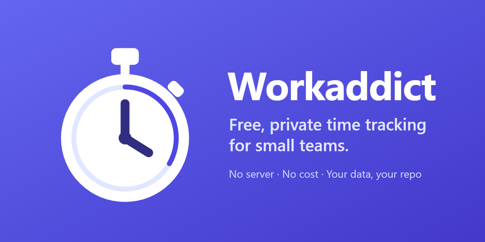

<p align="center">
  
</p>

<p align="center">
  <a href="https://github.com/Workaddict/workaddict/stargazers"></a>
  
  <a href="https://workaddict.me"></a>
  <a href="LICENSE"></a>
</p>

<p align="center">
  <b>If Workaddict saves you a Clockify subscription, please <a href="https://github.com/Workaddict/workaddict/stargazers">⭐ star the repo</a>. It helps other teams find it.</b>
</p>

# Workaddict

A private, free and simple time tracker for small teams, as an alternative to Clockify.

- **No server, no cost.** The app is a static website hosted on GitHub Pages.
- **Your data stays in your own repository.** Every entry, project and tag is stored as a JSON file in a **private GitHub repository** (the "data repo") that you control. The app reads and writes it straight from your browser through the GitHub API.
- **Features:** a live timer that syncs across devices, manual entries (including overnight ones), projects and tags, statistics with charts, and exports to PDF, Excel (.xlsx), OpenDocument (.ods) and CSV from one Export menu, plus a full JSON backup. Team roles (worker, editor, team leader), a live "Team now" view for editors and team leaders, and entries you can edit by clicking a field. English and German UI (switchable on the login page), light and dark themes with a one-click toggle, works on mobile.
- **Full history.** Each change is a git commit with a readable message (`entry: add 2h "Fix login" (alice)`), so the data repo doubles as an audit log that you can revert.

Try it without an account at **[workaddict.me](https://workaddict.me)** by clicking **"Try the demo"** on the start page. Demo data stays in memory and is never saved.

---

## How it works

```
Browser (this app, GitHub Pages)  ──GitHub REST API──►  private data repo
                                                         ├─ tracker.json          schema version
                                                         ├─ workspace.json        projects & tags
                                                         ├─ roles.json            member roles (optional)
                                                         ├─ entries/<login>/<YYYY-MM>.json
                                                         └─ timers/<login>.json   running timer
```

- Each member writes only their own entry and timer files, so members don't overwrite each other. `workspace.json` is shared, and its writes retry automatically on conflicts.
- Timestamps are stored in UTC and shown in local time.
- Team members are the collaborators of the data repo. Everyone sees everyone's entries. Who may change what depends on their [role](#5-assign-roles).
- `roles.json` stores the role of each member (optional; created when an owner assigns the first role).
- On the first login the app creates `tracker.json` and `workspace.json` in an empty data repo.

---

## Setup

You need two repositories:

| Repository              | Visibility                              | Contents                              |
| ----------------------- | --------------------------------------- | ------------------------------------- |
| **App repo** (this one) | public (required for free GitHub Pages) | source code only, no data, no secrets |
| **Data repo**           | **private**                             | your team's time data                 |

> **The order matters.** The team owner first sets up the organization, the data repo, and everyone's access (step 1). **Only then** does each member create their token (step 2). A token created _before_ its owner had access to the data repo will not work, even after access is granted later. See [Troubleshooting sign-in](#troubleshooting-sign-in).

### 1. Create the organization and the data repo (team owner, once)

The team owner does this once for the whole team. We recommend a **free GitHub organization**. The data repo lives inside it.

**Why an organization?** Fine-grained tokens (the safe kind) only work for repositories owned by **your own account** or by an **organization you belong to**. If the data repo belongs to someone else's personal account, the other members have to use classic tokens, which can access _all_ of their repositories.

#### 1.1 Create the organization

1. Sign in to GitHub and open <https://github.com/organizations/plan>.
2. Choose the **Free** plan and click **Create a free organization**.
3. **Organization name:** choose a short name, e.g. `my-team`. This name is the `owner` part of the data repo name later on (`my-team/time-data`).
4. **Contact email:** your email address.
5. **This organization belongs to:** _My personal account_.
6. Solve the verification, accept the terms, and click **Next**.
7. You can skip the "Add organization members" screen for now by clicking **Skip this step**. You invite members in step 1.3.

You are now the **owner** of the organization.

#### 1.2 Create the private data repo

1. Open `https://github.com/organizations/my-team/repositories/new` (replace `my-team` with your organization name). Alternatively: open the organization page → **Repositories** tab → **New repository**.
2. **Owner:** make sure your **organization** is selected, not your personal account.
3. **Repository name:** e.g. `time-data`.
4. **Visibility:** **Private**. This is important, since the repo holds all your team's time data.
5. Leave **Add a README**, **.gitignore**, and **license** unchecked. The repo can be empty; the app initializes it on the first sign-in.
6. Click **Create repository**.

The full name of the data repo is now `my-team/time-data`. Write it down; every member needs it to sign in.

#### 1.3 Invite your team members to the organization

1. Open the organization page → **People** tab → **Invite member** (or go to `https://github.com/orgs/my-team/people`).
2. Enter the member's **GitHub username** or email address and click **Invite**.
3. Choose the role **Member** (not Owner, unless they should be able to manage the organization) and click **Send invitation**.
4. Repeat for every team member.

Every member must **accept the invitation**. They get an email, or they can open `https://github.com/orgs/my-team/invitation` while signed in and click **Join my-team**. An invitation that has not been accepted gives **no access** at all.

#### 1.4 Give the members write access to the data repo

Being a member of the organization is not enough. By default, organization members only get **Read** access to the organization's repos, or none at all, and the app needs **Write**.

1. Open the data repo → **Settings** → **Collaborators and teams** (under _Access_ in the left sidebar).
2. Click **Add people**, search for the member, select them, choose the role **Write**, and click **Add … to this repository**.
3. Repeat for every member.

**Tip for larger teams:** create a team (organization → **Teams** → **New team**, e.g. `trackers`), add all members to it, and then add the team to the data repo with the role **Write** via **Add teams**. New members then only have to be added to the team.

Members who should be able to **assign roles** in the app need the role **Admin** instead of Write (see [Assign roles](#5-assign-roles)).

#### 1.5 Check the token policy of the organization

1. Open the organization page → **Settings** → in the left sidebar under _Third-party Access_ → **Personal access tokens** → **Settings** (or `https://github.com/organizations/my-team/settings/personal-access-tokens`).
2. On the **Fine-grained tokens** tab:
   - **Allow access via fine-grained personal access tokens** must be selected. Otherwise nobody can use a fine-grained token for the data repo.
   - **Require administrator approval:** if you select this, you have to approve every member's token before it works (step 2.3). If you select **Do not require administrator approval**, tokens work immediately. For a small team you trust, _no approval_ is simpler.
3. Click **Save**.

**Checklist before members create their tokens:**

- [ ] The organization exists and the data repo is **private** and owned by the **organization**.
- [ ] Every member has **accepted** the organization invitation.
- [ ] Every member has **Write** (or Admin) on the data repo.
- [ ] Fine-grained tokens are **allowed** in the organization.

**Test:** each member opens `https://github.com/my-team/time-data` in the browser while signed in to GitHub. If they see the (possibly empty) repo, their access is correct. If they see a **404 page**, their access is not set up yet. Fix that first, before they create a token.

**Alternative without an organization:** a private repo in your personal account works too. You can use a fine-grained token yourself, but your collaborators must use classic tokens (see [Fallback: classic token](#24-fallback-classic-token)). Add them under the repo's **Settings → Collaborators → Add people**; they have to accept the invitation.

### 2. Create a personal access token (every member)

Every team member creates **their own** token on **their own** GitHub account. Never share one token between people: the app uses the token to find out who you are, and all your entries are saved under that account.

> ⚠️ Create the token only **after** you have accepted the organization invitation and can open the data repo in your browser (see the test above). A token created earlier cannot be fixed afterwards. If you already have one, **delete it and create a new one**.

#### 2.1 Create a fine-grained token (recommended)

1. Sign in to GitHub with **your own** account and open <https://github.com/settings/personal-access-tokens/new>. Alternatively: click your profile picture (top right) → **Settings** → **Developer settings** (at the bottom of the left sidebar) → **Personal access tokens** → **Fine-grained tokens** → **Generate new token**.
2. **Token name:** something recognizable, e.g. `Workaddict`.
3. **Description** (optional): e.g. `Time tracking`.
4. **Resource owner:** open the dropdown and select the **organization** that owns the data repo (e.g. `my-team`), **not** your own username.
   - This setting **cannot be changed later**. If you pick the wrong owner, delete the token and create a new one.
   - If the organization is missing from the dropdown, you have not accepted the invitation yet (step 1.3), or the organization does not allow fine-grained tokens (step 1.5).
5. **Expiration:** choose how long the token stays valid, e.g. 90 days or a custom date. When it expires, the app asks you to sign in again with a new token. _No expiration_ is possible but less safe.
6. **Repository access:** select **Only select repositories**, open the **Select repositories** dropdown, and pick the data repo (e.g. `my-team/time-data`).
   - If the repo is missing from the list, you don't have access to it yet (step 1.4), or you selected the wrong resource owner.
7. **Permissions:** under **Repository permissions**, find **Contents** and set it to **Read and write**. (In newer versions of the form: click **Add permissions** → **Repositories**, tick **Contents**, then set the access level next to it to **Read and write**.)
   - **Metadata: Read-only** is added automatically. It is required; leave it.
   - Don't grant any other permissions. The app does not need them.
8. Scroll down, check the summary (_Access on 1 repository_ and _Read and write access to code_), and click **Generate token**. If a confirmation dialog appears, click **Generate token** again.
9. **Copy the token right away** (it starts with `github_pat_`). GitHub shows it only once. If you lose it, create a new one.

#### 2.2 If you need approval

If the organization requires approval (step 1.5), your token shows up as **pending** and every request to the data repo fails with _"The repository cannot be accessed"_ until an organization owner approves it. Tell your team owner that you created a token.

#### 2.3 Approve tokens (team owner)

1. Open the organization page → **Settings** → _Third-party Access_ → **Personal access tokens** → **Pending requests** (or `https://github.com/organizations/my-team/settings/personal-access-token-requests`).
2. Click the member's request, check that it only asks for the data repo with **Contents: Read and write**, and click **Approve**.

You only see this page if you are an **owner** of the organization. If the list is empty, either no token is waiting or approval is turned off.

#### 2.4 Fallback: classic token

Use a classic token only if the data repo is owned by **another person's personal account**, or as a quick temporary workaround.

1. Open <https://github.com/settings/tokens/new> (Settings → Developer settings → Personal access tokens → **Tokens (classic)** → **Generate new token (classic)**).
2. **Note:** e.g. `Workaddict`. **Expiration:** as you like.
3. Tick the **`repo`** scope (the whole group). Leave everything else unticked.
4. Click **Generate token** and copy the token (it starts with `ghp_`).

> ⚠️ A classic `repo` token grants read and write access to **all** repositories you can access, not just the data repo. Prefer a fine-grained token in an organization. Organizations can also block classic tokens (step 1.5, **Personal access tokens (classic)** tab).

### 3. Deploy the app to GitHub Pages

1. Push this repository to GitHub, as a **public** repo.
2. Go to **Settings → Pages → Build and deployment → Source:** select **GitHub Actions**.
3. Push to `main`. The workflow in [`.github/workflows/deploy.yml`](.github/workflows/deploy.yml) runs `npm ci` → `npm test` → `npm run build` and deploys `dist/`. If tests fail, nothing is deployed and the previous version stays live.
4. The app is available at `https://<user-or-org>.github.io/<app-repo>/`.

The build uses a relative base path and hash routing (`#/stats`), so it works under any repo name and page reloads never 404.

> **Deploying your own copy?** `index.html` (canonical and `og:` URLs), `public/robots.txt` and `public/sitemap.xml` point to `https://workaddict.me`. Change them to your own URL, or search engines will treat your copy as a duplicate of the official site.

### 4. Sign in

1. Open the Pages URL.
2. **Token:** paste your token.
3. **Repository:** enter the data repo as `owner/name`, exactly as it appears in the browser's address bar when you open the repo, e.g. `my-team/time-data`. The owner is the **organization name**, not your username.
4. Optionally tick **"Remember me on this device"** (not on shared computers).
5. Click **Sign in**. The first sign-in initializes the empty data repo.

If sign-in fails, see [Troubleshooting sign-in](#troubleshooting-sign-in).

### 5. Assign roles

Every member has one of three roles:

| Permission                                                      | Worker | Editor | Team leader |
| --------------------------------------------------------------- | :----: | :----: | :---------: |
| Track time, run own timer, edit and delete own entries          |   ✓    |   ✓    |      ✓      |
| See all entries and statistics, export                          |   ✓    |   ✓    |      ✓      |
| Edit and delete other members' entries                          |        |   ✓    |      ✓      |
| See who is tracking right now ("Team now" on the tracker page)  |        |   ✓    |      ✓      |
| Stop or discard other members' running timers                   |        |   ✓    |      ✓      |
| Create, rename, recolor, archive, and delete projects and tags  |        |   ✓    |      ✓      |
| Import from Clockify                                            |        |        |      ✓      |

- **Owners** are everyone with **admin** permission on the data repo. For a personal repo that is the account owner; in an organization it is the repo or organization admins. Owners are always team leaders, and **only owners assign roles** (under **Settings → Team & roles**), including making other members team leaders.
- Members without an assigned role are **workers**. **Upgrading from an earlier version:** after the update, everyone except the owners is a worker until an owner assigns roles. The app shows owners a reminder until the first role is assigned.
- **Team now.** Editors and team leaders see, above their entries, what every other member is tracking right now (description, project, tags, elapsed time), each member's total for today, and when idle members were last active. A timer that has run for more than 10 hours, or since before today, is flagged. They can stop such a timer at a chosen end time or discard it. The member gets a notice, the entry records who stopped it, and the commit message names both. There is no opt-out. Workers don't see the block, but the running timers in `timers/` can be read by anyone with access to the data repo.
- Roles are enforced by the app, **not by GitHub**. See [Security notes](#security-notes).

### 6. Optional: import your Clockify history

Switching from Clockify? A team leader opens **Settings → Data → Import from Clockify**. The wizard imports projects (name, color, archived), tags, and all completed time entries of the users you select, in a **single commit**.

- **Replaces existing data.** If the data repo already has entries, projects, or tags, the wizard shows how many and asks for confirmation; the import then **replaces all of them** (running timers are kept). There is no merging. The old data stays in the data repo's git history and can be restored by reverting the import commit.
- **API key.** Create one in Clockify under _Profile settings → API_. To import the whole team, it must be the key of a **Clockify workspace admin**; other keys can only read their own entries. The key is kept in memory only, sent only to Clockify, and never saved. **Delete it in Clockify after the import.**
- **User mapping.** Map each Clockify user to a GitHub login of the team, keep them as a **former member** (read-only pseudo-login `clockify.<name>`, so yearly totals stay correct), or skip them.
- **Changing the mapping later.** Mapped a Clockify user to the wrong member, or a former member joined the team? A team leader opens **Settings → Data → Reassign entries** and moves all entries of one member (including `clockify.*` former members) to another, in one commit. Tick **"Only entries that started before a date"** and pick the import day so that entries the member tracked in Workaddict afterwards stay with them.
- **Free plan limits.** Clockify Free allows only 30 API requests per hour. The import uses large pages (about 5 requests plus 1–2 per user), shows a request counter, and if the limit is hit it pauses and lets you **continue later** without re-fetching what was already loaded. Keep the tab open until the import is done.
- **Not imported:** clients, tasks, billable flags, rates, custom fields, and running timers. The preview shows how many entries are affected and lists hours per member and project so you can compare them with Clockify's summary report.

---

## Troubleshooting sign-in

The login page first checks the token and then the data repo. The error message tells you which step failed.

| Message on the login page | Cause | Fix |
| ------------------------- | ----- | --- |
| _Enter the repository as owner/name_ | The repo field has the wrong format. | Enter `my-team/time-data`, with no `https://github.com/` in front. |
| _GitHub rejected this token_ | Token incomplete, expired, or deleted. | Copy it again without spaces, or create a new one (step 2). |
| _The repository cannot be accessed_ | The token is valid but can't see the repo. GitHub answers with **404** (visible in the browser console as `Failed to load resource: … 404`). | Work through the checklist below. |
| _The token can read but not write this repository_ | **Contents** is only _Read-only_, or the member only has **Read** on the repo. | Set Contents to _Read and write_ (step 2.1, item 7) and give the member **Write** (step 1.4). |
| _GitHub rate limit reached_ | Too many requests. | Wait until the time shown. See the note below. |

**Checklist for _"The repository cannot be accessed"_ (404):**

1. **Was the token created before the member had access?** This is the most common cause. If the token was created before the member accepted the organization invitation or before they had Write on the data repo, it stays unable to reach the repo, and editing it later doesn't help. **Delete the token and create a new one** (step 2.1).
2. **Can the member open the repo in the browser?** They open `https://github.com/my-team/time-data` while signed in. If they see a 404 page, the problem is their access, not the token. Go back to steps 1.3 and 1.4.
3. **Is the resource owner correct?** Open the token under Settings → Developer settings → Fine-grained tokens. _Resource owner_ must be the **organization**. If it's the member's own account, create a new token.
4. **Is the data repo selected?** On the same page, _Repository access_ must list the data repo.
5. **Is the token still waiting for approval?** An organization owner checks **Pending requests** (step 2.3).
6. **Is the repo name correct?** Compare it character by character with the address bar (hyphens vs. underscores, organization name vs. username).

**Test without the app:** run this in a terminal with the member's token:

```bash
curl -H "Authorization: Bearer <TOKEN>" https://api.github.com/repos/my-team/time-data
```

If this returns JSON with `"full_name": "my-team/time-data"` and `"push": true`, the token is fine. If it returns `"message": "Not Found"`, the problem is on GitHub's side (checklist above).

**Rate limit when testing in the browser:** don't test by opening `https://api.github.com/...` links directly in the browser. Those requests are sent **without a token**, so GitHub only allows 60 per hour per IP address, shared by everyone in the same office network. They also always return 404 for a private repo. Some browsers auto-translate the message into something confusing (such as "installment payment" for "rate limit"). Use the `curl` command above instead. With a token, the limit is 5,000 requests per hour per token.

---

## Security notes

Read this before you use the app with real data. To report a vulnerability, see [SECURITY.md](SECURITY.md).

- **Roles are not a security boundary.** Anyone with write access to the data repo can read and change _all_ data through the GitHub API or the GitHub website, including other members' entries, projects, and `roles.json` itself. The app checks roles before every change it makes, but it cannot stop direct edits to the repository. Only add people you trust. Every change is a commit that names the acting user (for example `entry: delete "Standup" for bob (carol)`, `role: set bob to editor (alice)`), so you can find and revert unwanted changes in the git history.
- **Your token is stored in your browser.** With "Remember me" it is kept in `localStorage`; without it, in `sessionStorage`, which is cleared when the tab closes. Anyone with access to your browser profile, or any script that runs on the page, could read it. To limit the risk:
  - use a **fine-grained token** limited to the data repo, with an expiration date (the app warns when you sign in with a classic token);
  - don't use "Remember me" on shared computers. Without it, repository data is cached in memory only and nothing stays on disk after the tab closes;
  - **log out** (Settings → Log out) to remove the token and cached data;
  - if a token leaks, revoke it on GitHub right away.
- **Content Security Policy.** The production build ships a strict CSP: scripts only from the app's own origin, and network requests only to `https://api.github.com` and, for the one-time Clockify import, `https://*.clockify.me`. Trusted Types are enforced and inline styles are not allowed. Nothing is sent anywhere else: no analytics, no third-party scripts at runtime.
- **No framing.** The app refuses to run inside another page (clickjacking protection) and offers a link to open it in its own tab.
- **Repository data is treated as untrusted.** Every file is validated before use. Broken or suspicious records (for example an entry in bob's file that claims to be alice's) are not shown, are listed in a notice, and are kept unchanged when the app writes the file. Files over 2 MB are not loaded.
- **Build pipeline.** GitHub Actions are pinned to commit SHAs, dependencies install without install scripts, the deploy fails on known high-severity vulnerabilities, and Dependabot proposes updates after a 7-day waiting period.
- **The app repo contains no data or secrets.** It is safe for it to be public.

---

## Development

Requirements: Node.js 20.19+ or 22.12+.

```bash
npm install
npm run dev        # dev server at http://localhost:5173 (use "Try the demo" to skip login)
npm test           # unit tests (Vitest)
npm run lint       # ESLint
npm run build      # type-check + production build into dist/
npm run preview    # serve the production build (with CSP) locally
```

### Project layout

```
src/
  domain/        types, time/duration helpers, month keys (pure, unit-tested)
  storage/       StorageAdapter interface, memory adapter, GitHub adapter
  features/      auth, tracker, workgroups, stats, export, settings
  i18n/          English and German texts
  styles/        design tokens, light/dark themes
```

All data access goes through the `StorageAdapter` interface (`src/storage/types.ts`). UI code never calls GitHub directly. That makes it possible to swap the backend later (e.g. for Supabase), and the JSON backup format serves as the migration path.

## License

Workaddict is free and open-source software, © 2026 Benedikt Lehner, licensed under the [GNU Affero General Public License v3.0](LICENSE) with two additional terms in [NOTICE](NOTICE).

In short:

- You may use, study, change and share the code, for free, also for your own team or company.
- If you publish a changed version, or run one as a website for others, you must share its source code under the same license.
- Keep the credit visible: the footer and Settings > About must keep showing "Made by Benedikt Lehner" and a link to this project.
- Mark changed versions as your own (for example "based on Workaddict by Benedikt Lehner"). Don't present them as the original.

This summary is for convenience; the [LICENSE](LICENSE) and [NOTICE](NOTICE) files are what counts.

**Built something with Workaddict?** Please [open an issue](https://github.com/Workaddict/workaddict/issues) and tell me about it. That's a request, not a condition, but I'd love to see it. Suggestions and pull requests are welcome too.
